<div dir="rtl">

# 📘 המדריך המלא ל-TailorCV

> מסמך זה מסביר את **כל** הפרויקט בעברית פשוטה — מההחלטות המוצריות, דרך הקוד והארכיטקטורה, ועד תהליך הפריסה (Deployment). בסוף יש סקירה כנה של **הטוב, הרע והמכוער**, ומה **חסר** בפרויקט.
>
> המסמך כולל תרשימים (Mermaid) שמצטיירים אוטומטית ב-GitHub וב-VS Code, וכן **צילומי מסך חיים** מהאתר הפעיל (ראו [פרק 4.1](#41-תצוגות-מסך-חיות-מהאתר)). אם אתה קורא בעורך שלא מצייר Mermaid, התרשימים יופיעו כקוד טקסט אבל עדיין קריאים.

---

## תוכן עניינים

1. [מה זה TailorCV ולמה הוא קיים](#1-מה-זה-tailorcv-ולמה-הוא-קיים)
2. [החלטות המוצר — הפילוסופיה](#2-החלטות-המוצר--הפילוסופיה)
3. [מבט-על על הארכיטקטורה](#3-מבט-על-על-הארכיטקטורה)
4. [זרימת המשתמש — מההתחלה ועד הסוף](#4-זרימת-המשתמש--מההתחלה-ועד-הסוף)
5. [ה-Backend — שישה מודולים ומנוע ה-AI](#5-ה-backend--שישה-מודולים-ומנוע-ה-ai)
6. [מנגנון ה-Guardrails נגד המצאות](#6-מנגנון-ה-guardrails-נגד-המצאות)
7. [ה-Frontend — אשף בשלושה שלבים](#7-ה-frontend--אשף-בשלושה-שלבים)
8. [התזמור בצד הלקוח — הסיפור החשוב ביותר](#8-התזמור-בצד-הלקוח--הסיפור-החשוב-ביותר)
9. [פריסה (Deployment) — Vercel, CI ו-Docker](#9-פריסה-deployment--vercel-ci-ו-docker)
10. [בדיקות (Tests)](#10-בדיקות-tests)
11. [הטוב, הרע והמכוער](#11-הטוב-הרע-והמכוער)
12. [מה חסר בפרויקט](#12-מה-חסר-בפרויקט)
13. [סיכום והמלצות](#13-סיכום-והמלצות)

---

## 1. מה זה TailorCV ולמה הוא קיים

**TailorCV** הוא מערכת מבוססת בינה מלאכותית שמתאימה (מ"תופרת", Tailor) קורות חיים למשרה ספציפית.

הרעיון: אתה מדביק **תיאור משרה** + **קורות החיים שלך**, והמערכת מייצרת גרסה מותאמת של קורות החיים שמדגישה בדיוק את מה שהמשרה מחפשת — בלי לשקר.

### הבעיה שהוא פותר

| בלי TailorCV | עם TailorCV |
|---|---|
| שולחים את אותם קורות חיים לכל משרה | כל משרה מקבלת גרסה מותאמת |
| מילות מפתח של המשרה (ATS) חסרות | מילות המפתח משולבות באופן טבעי |
| הניסוח לא מדבר בשפת המשרה | ההישגים מנוסחים מחדש בשפה רלוונטית |
| קל "להמציא" כדי להיראות טוב | המערכת **חוסמת** המצאות אוטומטית |

### העיקרון המקודש

> 🔒 **המערכת לעולם לא ממציאה ניסיון.** היא רק **מארגנת מחדש, מנסחת מחדש ומדגישה** עובדות שכבר קיימות בקורות החיים המקוריים.

זו ההבטחה המרכזית של המוצר, וכפי שנראה בהמשך — היא נאכפת גם דרך ה-prompts (ההנחיות ל-AI) וגם דרך שכבת בדיקות (Guardrails).

---

## 2. החלטות המוצר — הפילוסופיה

### 2.1 שלוש רמות מחמירוּת (Strictness)

המשתמש בוחר כמה "אגרסיבית" תהיה ההתאמה. זו החלטת מוצר מרכזית:

| רמה | כישורים מוסקים | ניסוח מחדש | הזרקת מילות מפתח | מתאים ל... |
|---|---|---|---|---|
| **Conservative** (שמרני) | ❌ לא מותר | מינימלי | רק אם יש הוכחה | תחומים מפוקחים (רפואה, פיננסים) |
| **Moderate** (מאוזן) | ✅ מותר | מאוזן | שילוב טבעי | רוב המקרים (ברירת מחדל) |
| **Aggressive** (אגרסיבי) | ✅ מותר | נרחב | מקסימום אופטימיזציה | שליחה בכמויות גדולות |

ההגדרות האלה מוגדרות בקוד כ-`STRICTNESS_CONFIGS` (בקובץ `backend/app/models/options.py`) ושולטות בארבעה "כפתורים" פנימיים: האם להתיר כישורים מוסקים, האם לאפשר ניסוח מחדש, עוצמת הזרקת מילות המפתח, ועד כמה לנסות "לגשר" על פערים.

### 2.2 מה המשתמש מקבל בסוף

1. **קורות חיים מותאמים** — מאורגנים ומנוסחים מחדש.
2. **ניתוח התאמה (Match Analysis)** — ציון 0–100 + פירוט פערים.
3. **יומן שינויים (Changes Log)** — כל שינוי עם הסבר למה.
4. **פריטים גבוליים (Borderline)** — שינויים שכדאי שתבדוק לפני שליחה.
5. **מכתב מקדים (Cover Letter)** — אופציונלי.
6. **ייצוא** — Markdown, Word (.docx) או PDF.

### 2.3 החלטות מוצר נוספות ששווה להכיר

- **אין חשבונות משתמש / אין שמירת מידע.** כל בקשה היא חד-פעמית (stateless). זה הופך את המוצר לפשוט ולפרטי, אבל אומר שאין היסטוריה.
- **טמפרטורה נמוכה (0.1) ל-AI** — בחירה מכוונת כדי שהפלט יהיה יציב וצפוי, ולא "יצירתי" מדי (שזה מסוכן כשמדברים על עובדות).
- **קישורי הגשה (Apply links)** — המערכת סורקת את תיאור המשרה ומוצאת אימיילים/קישורים להגשה, ומסננת החוצה את פרטי הקשר של המועמד עצמו. מגע מוצרי נחמד.

---

## 3. מבט-על על הארכיטקטורה

ברמה הגבוהה ביותר, יש שלושה שחקנים: הדפדפן (React), שרת ה-API (FastAPI), ומנוע ה-AI (Google Gemini).

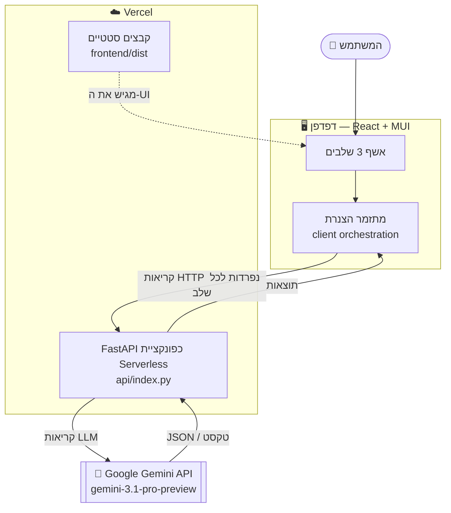
```mermaid
flowchart TD
    User([👤 המשתמש])
    subgraph Browser["🖥️ דפדפן — React + MUI"]
        UI[אשף 3 שלבים]
        Orch[מתזמר הצנרת<br/>client orchestration]
    end
    subgraph Vercel["☁️ Vercel"]
        Static[קבצים סטטיים<br/>frontend/dist]
        API[FastAPI כפונקציית Serverless<br/>api/index.py]
    end
    Gemini[[🤖 Google Gemini API<br/>gemini-3.1-pro-preview]]

    User --> UI
    UI --> Orch
    Orch -->|קריאות HTTP נפרדות לכל שלב| API
    Static -.מגיש את ה-UI.-> UI
    API -->|קריאות LLM| Gemini
    Gemini -->|JSON / טקסט| API
    API -->|תוצאות| Orch
```

**שלוש שכבות הטכנולוגיה:**

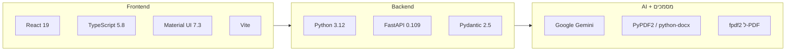
```mermaid
flowchart LR
    subgraph FE["Frontend"]
        A1[React 19]
        A2[TypeScript 5.8]
        A3[Material UI 7.3]
        A4[Vite]
    end
    subgraph BE["Backend"]
        B1[Python 3.12]
        B2[FastAPI 0.109]
        B3[Pydantic 2.5]
    end
    subgraph AI["AI + מסמכים"]
        C1[Google Gemini]
        C2[PyPDF2 / python-docx]
        C3[fpdf2 ל-PDF]
    end
    FE --> BE --> AI
```

**מבנה התיקיות (פושט):**

```
TailorCV/
├── api/index.py          ← נקודת כניסה ל-Serverless ב-Vercel (מתאם דק)
├── backend/app/
│   ├── main.py           ← אפליקציית FastAPI, CORS, טיפול בשגיאות
│   ├── config.py         ← הגדרות (מפתח API, מודל, CORS)
│   ├── models/           ← מבני נתונים (Pydantic) — 6 קבצים
│   ├── services/         ← הלוגיקה העסקית — 6 המודולים + הצנרת
│   ├── utils/            ← עטיפת ה-LLM, ניתוח מסמכים, ייצוא, rate-limit
│   └── routers/tailor.py ← הגדרת ה-endpoints של ה-API
├── frontend/src/
│   ├── App.tsx           ← מרכז הניהול (state) + האשף
│   ├── components/       ← 5 קומפוננטות מסך
│   ├── services/api.ts   ← הלקוח שמתזמר את הצנרת
│   ├── utils/apply.ts    ← חילוץ קישורי הגשה
│   └── types/index.ts    ← הטיפוסים המשותפים
├── vercel.json           ← הגדרת הפריסה
├── docker-compose.yml    ← סביבת פיתוח מקומית
└── .github/workflows/ci.yml ← בדיקות אוטומטיות
```

---

## 4. זרימת המשתמש — מההתחלה ועד הסוף

הנה מה שקורה מרגע שהמשתמש נכנס ועד שהוא מוריד קובץ:

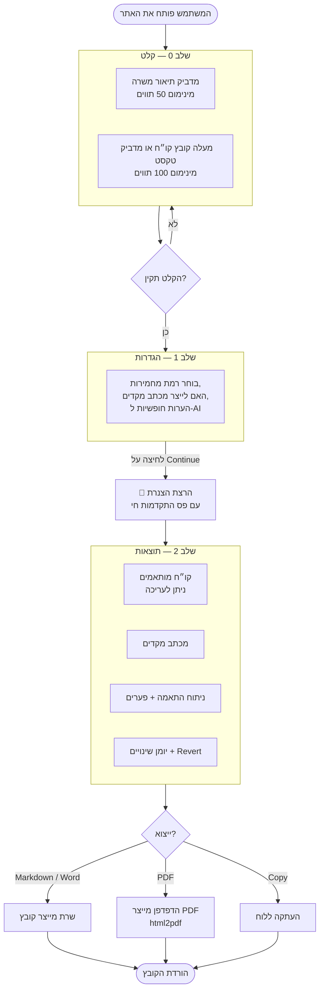
```mermaid
flowchart TD
    Start([המשתמש פותח את האתר]) --> S0

    subgraph S0["שלב 0 — קלט"]
        JD[מדביק תיאור משרה<br/>מינימום 50 תווים]
        CV[מעלה קובץ קו״ח או מדביק טקסט<br/>מינימום 100 תווים]
    end

    S0 --> Valid{הקלט תקין?}
    Valid -->|לא| S0
    Valid -->|כן| S1

    subgraph S1["שלב 1 — הגדרות"]
        Opt[בוחר רמת מחמירות,<br/>האם לייצר מכתב מקדים,<br/>הערות חופשיות ל-AI]
    end

    S1 -->|לחיצה על Continue| Pipe[🔄 הרצת הצנרת<br/>עם פס התקדמות חי]
    Pipe --> S2

    subgraph S2["שלב 2 — תוצאות"]
        R1[קו״ח מותאמים<br/>ניתן לעריכה]
        R2[מכתב מקדים]
        R3[ניתוח התאמה + פערים]
        R4[יומן שינויים + Revert]
    end

    S2 --> Export{ייצוא?}
    Export -->|Markdown / Word| Server[שרת מייצר קובץ]
    Export -->|PDF| Client[הדפדפן מייצר PDF<br/>html2pdf]
    Export -->|Copy| Clip[העתקה ללוח]
    Server --> Done([הורדת הקובץ])
    Client --> Done
    Clip --> Done
```

נקודה חשובה: שלב "הרצת הצנרת" הוא לא קריאה אחת לשרת — הוא רצף של מספר קריאות שהדפדפן מנהל בעצמו. נסביר זאת לעומק בפרק 8.

### 4.1 תצוגות מסך חיות מהאתר

> צילומי המסך הבאים צולמו **בפועל** מהאתר החי [tailor-cv.yishaik.com](https://tailor-cv.yishaik.com), על ריצה אמיתית של הצנרת (משרת "Senior Frontend Engineer" + קו״ח לדוגמה).

**שלב 0 — קלט (Input):** המשתמש מדביק תיאור משרה ומעלה/מדביק קו״ח. כפתור ה-Continue נעול עד שהקלט תקין.

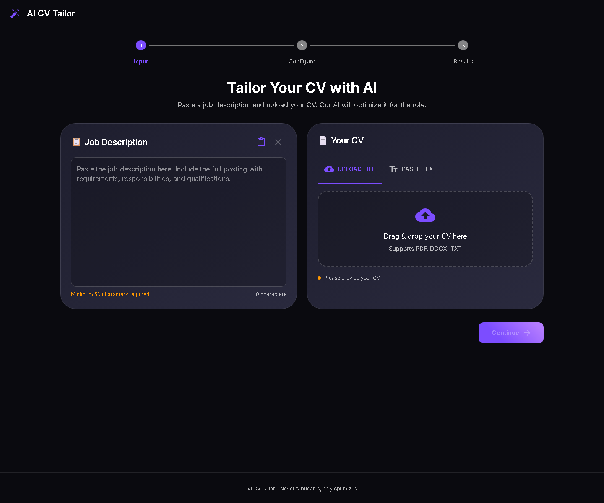

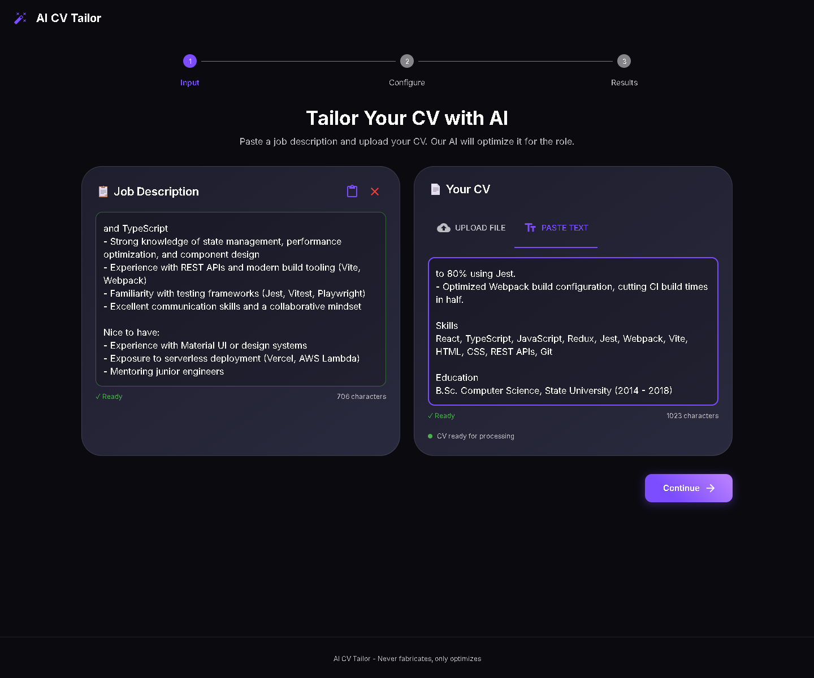

**שלב 1 — הגדרות (Configure):** בחירת מכתב מקדים, רמת מחמירות (Conservative/Moderate/Aggressive), ופורמט ייצוא. שימו לב לבורר **Export Format** — זהו ה"קוד המת" שצוין בפרק 11: הבחירה כאן לא נשלחת בכלל ל-API.

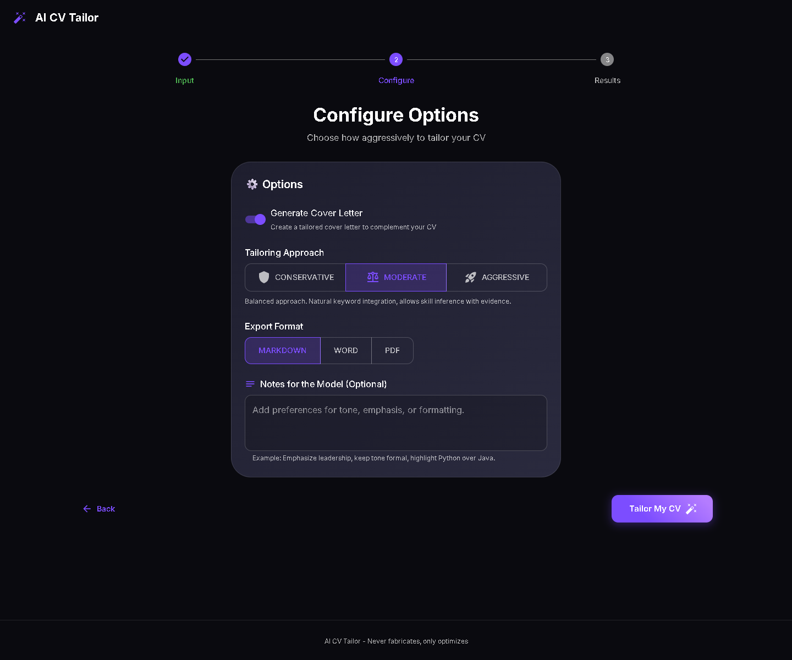

**במהלך העיבוד:** דיאלוג התקדמות אמיתי שמראה את 6 שלבי הצנרת אחד-אחד ("Analyzing… → Extracting CV facts… → Mapping… → Generating… → Quality checks… → Cover letter…"). זה אפשרי בזכות התזמור בצד הלקוח (פרק 8).

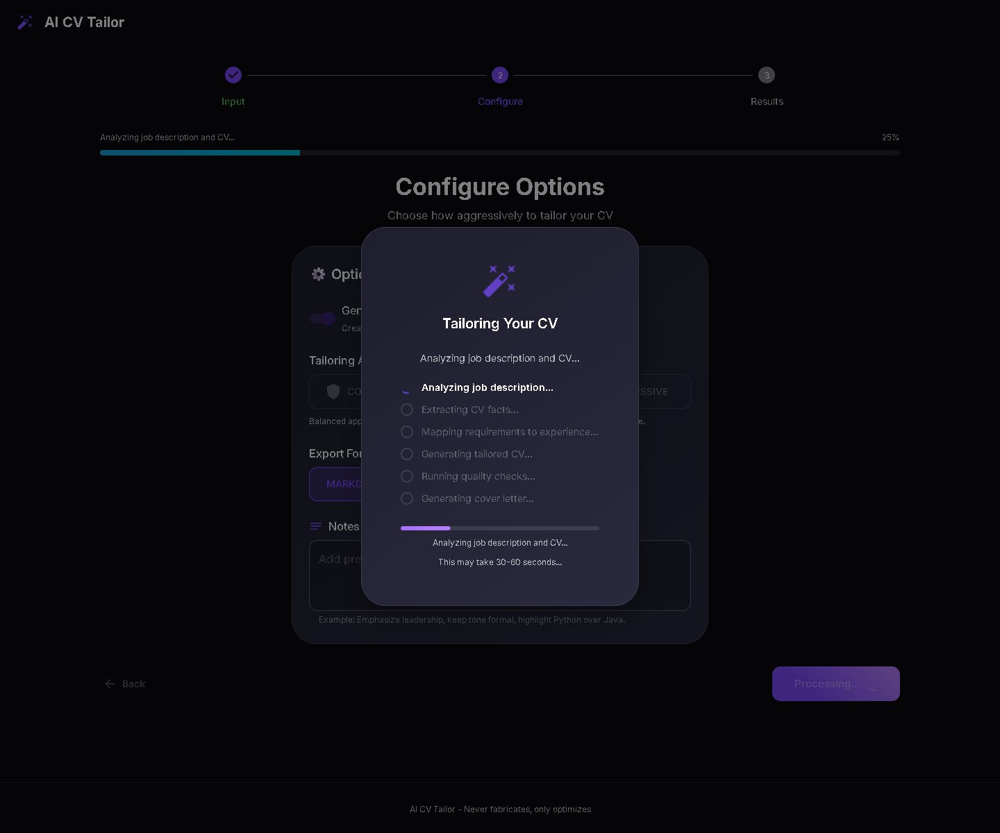

**שלב 2 — תוצאות (Results):** קו״ח מותאמים עם ציון התאמה (כאן **89**), 4 טאבים, ופאנל ייצוא בצד.

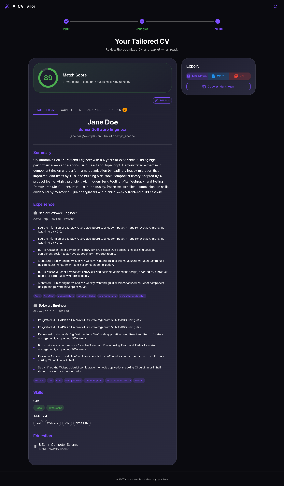

**טאב הניתוח (Analysis):** "מה חסר ואיך לגשר" + "דרישות שאתה עונה עליהן" + כיסוי מילות מפתח ATS. כאן רואים את עבודת ה-Mapper (מודול 3) בצורה החזותית.

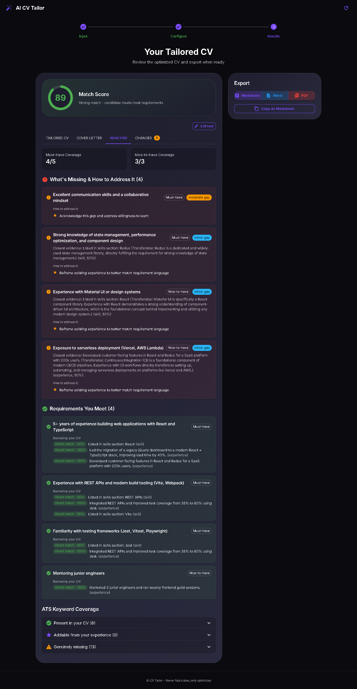

**טאב השינויים (Changes):** יומן כל שינוי עם הסבר, וכפתורי Revert/Re-apply.

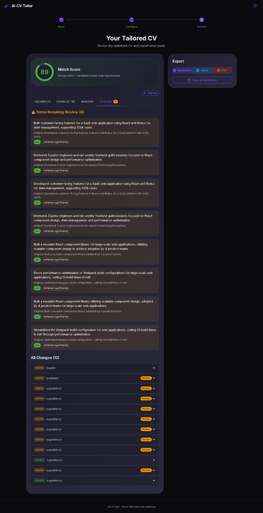

**טאב המכתב המקדים (Cover Letter):**

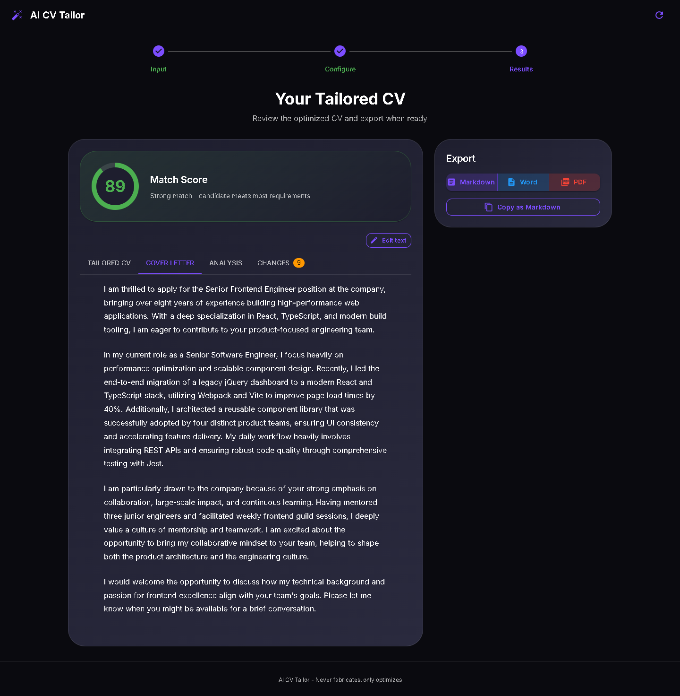

> 💡 צילומי המסך הופקו אוטומטית בעזרת הסקריפט `docs/screenshots/shoot.mjs` (Playwright). אפשר להריץ אותו שוב כדי לרענן אותם.

---

## 5. ה-Backend — שישה מודולים ומנוע ה-AI

לב המערכת הוא **צנרת (Pipeline) של 6 מודולים**. כל מודול הוא שירות (service) נפרד שמקבל קלט מובנה ומחזיר פלט מובנה.

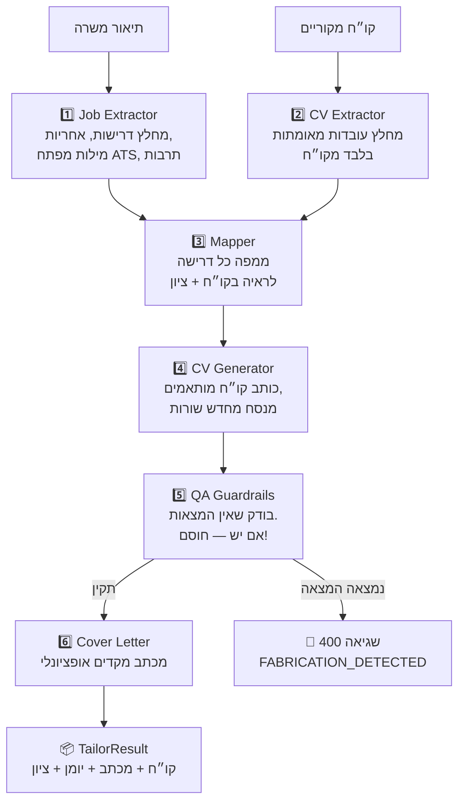
```mermaid
flowchart TD
    IN1[תיאור משרה] --> M1
    IN2[קו״ח מקוריים] --> M2

    M1["1️⃣ Job Extractor<br/>מחלץ דרישות, אחריות,<br/>מילות מפתח ATS, תרבות"]
    M2["2️⃣ CV Extractor<br/>מחלץ עובדות מאומתות<br/>בלבד מקו״ח"]

    M1 --> M3
    M2 --> M3
    M3["3️⃣ Mapper<br/>ממפה כל דרישה<br/>לראיה בקו״ח + ציון"]

    M3 --> M4
    M4["4️⃣ CV Generator<br/>כותב קו״ח מותאמים,<br/>מנסח מחדש שורות"]

    M4 --> M5
    M5["5️⃣ QA Guardrails<br/>בודק שאין המצאות.<br/>אם יש — חוסם!"]

    M5 -->|תקין| M6
    M5 -->|נמצאה המצאה| BLOCK[🛑 שגיאה 400<br/>FABRICATION_DETECTED]

    M6["6️⃣ Cover Letter<br/>מכתב מקדים אופציונלי"]
    M6 --> OUT[📦 TailorResult<br/>קו״ח + מכתב + יומן + ציון]
```

### 5.1 פירוט המודולים

| # | מודול | קובץ | מה הוא עושה | משתמש ב-AI? |
|---|---|---|---|---|
| 1 | **Job Extractor** | `services/job_extractor.py` | הופך תיאור משרה חופשי לרשימה מובנית: דרישות חובה / רצויות, אחריות, מילות מפתח ATS לפי עדיפות, ורמזי תרבות. | ✅ (JSON מובנה) |
| 2 | **CV Extractor** | `services/cv_extractor.py` | מחלץ **רק עובדות מאומתות** מקו״ח, שומר על הניסוח המקורי, מחשב משך תעסוקה. **מוחק כישורים מוסקים שאין להם הוכחה.** | ✅ (JSON מובנה) |
| 3 | **Mapper** | `services/mapper.py` | מקשר כל דרישה של המשרה לראיה בקו״ח, נותן ציון רלוונטיות (0–100), ומסווג סוג התאמה (ישירה / ניתנת להעברה / חלקית / פוטנציאל למידה). מחשב ציון התאמה כולל. | ✅ (לכישורים ניתנים-להעברה) |
| 4 | **CV Generator** | `services/cv_generator.py` | בונה את קו״ח המותאמים חלק-אחר-חלק: כותרת, תקציר, ניסיון (כל שורה משוכתבת), כישורים, פרויקטים. צובר יומן שינויים ופריטים גבוליים. | ✅ (תקציר + שכתוב שורות) |
| 5 | **QA Guardrails** | `services/qa_guardrails.py` | **ללא AI** — בדיקות Python טהורות. מאתר חברות/כישורים שלא היו במקור, מסמן הגזמות, מחשב ציון התאמה סופי. | ❌ |
| 6 | **Cover Letter** | `services/cover_letter.py` | כותב מכתב מקדים ב-4 פסקאות (וו פתיחה, הצעת ערך, נרטיב התאמה, סגירה), בטון שמתאים לתרבות החברה. | ✅ |

### 5.2 איך מדברים עם ה-AI (Gemini)

כל הקשר עם Gemini עובר דרך מחלקה אחת: `utils/llm_client.py`. יש לה שתי דרכי קריאה:

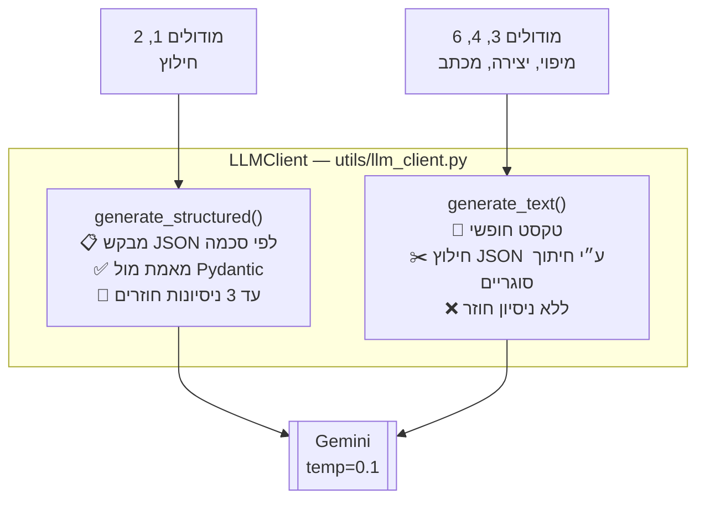
```mermaid
flowchart TD
    subgraph LLM["LLMClient — utils/llm_client.py"]
        direction TB
        S["generate_structured()<br/>📋 מבקש JSON לפי סכמה<br/>✅ מאמת מול Pydantic<br/>🔁 עד 3 ניסיונות חוזרים"]
        T["generate_text()<br/>📝 טקסט חופשי<br/>✂️ חילוץ JSON ע״י חיתוך סוגריים<br/>❌ ללא ניסיון חוזר"]
    end
    M1b[מודולים 1, 2<br/>חילוץ] --> S
    M3b[מודולים 3, 4, 6<br/>מיפוי, יצירה, מכתב] --> T
    S --> G[[Gemini<br/>temp=0.1]]
    T --> G
```

**מה חשוב להבין כאן:**
- **המודל**: `gemini-3.1-pro-preview` — מודל יחיד לכל השלבים.
- **טמפרטורה 0.1** — נמוך בכוונה, לפלט יציב.
- הדרך ה"מובנית" (extraction) **חזקה**: סכמה + אימות + ניסיונות חוזרים.
- הדרך של "טקסט חופשי" **שברירית**: היא מחלצת JSON על-ידי חיתוך מהסוגר `{` הראשון עד `}` האחרון, ואין ניסיון חוזר. אם ה-AI מחזיר משהו לא צפוי — היא נשענת על "נפילה רכה" (fallback) חזרה לטקסט המקורי.
- ⚠️ אי-דיוק קטן בקוד: ה-docstring טוען שמשתמשים ב"מצב JSON מובנה של Gemini", אבל בפועל פשוט מבקשים JSON בטקסט. לא באג, אבל מטעה למתחזק.

### 5.3 הרצה במקביל (Concurrency) — הגיבור הנסתר

כדי שהכל יספיק בזמן (ראו פרק 8), המערכת מריצה קריאות AI **במקביל** ב-`asyncio.gather`:
- מודולים 1 ו-2 רצים יחד.
- ב-Mapper, כל דרישה ממופה במקביל.
- ב-Generator, **כל שורת ניסיון משוכתבת במקביל** (gather מקונן).

זה מקצר את זמן הריצה מ"סכום כל הקריאות" ל"הקריאה הכי איטית".

---

## 6. מנגנון ה-Guardrails נגד המצאות

זו ההבטחה המרכזית של המוצר, אז שווה לפרק אותה לעומק. המודול `qa_guardrails.py` מריץ סדרת בדיקות:

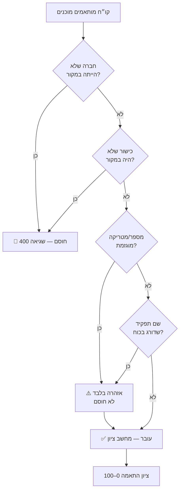
```mermaid
flowchart TD
    Start[קו״ח מותאמים מוכנים] --> C1

    C1{חברה שלא<br/>הייתה במקור?}
    C1 -->|כן| HARD[🛑 חוסם — שגיאה 400]
    C1 -->|לא| C2

    C2{כישור שלא<br/>היה במקור?}
    C2 -->|כן| HARD
    C2 -->|לא| C3

    C3{מספר/מטריקה<br/>מוגזמת?}
    C3 -->|כן| WARN[⚠️ אזהרה בלבד<br/>לא חוסם]
    C3 -->|לא| C4

    C4{שם תפקיד<br/>שדורג בכוח?}
    C4 -->|כן| WARN
    C4 -->|לא| OK

    WARN --> OK[✅ עובר — מחשב ציון]
    OK --> Score[ציון התאמה 0–100]
```

### האמת על ה-Guardrails — חזק או נאיבי?

הערכה כנה: **המנגנון נשען על השוואת מחרוזות פשוטה (string matching), והוא בעיקר רשת ביטחון — לא מאמת סמנטי אמיתי.**

- ✅ **מה שטוב**: שתי בדיקות באמת **חוסמות** פלט — חברה מומצאת וכישור מומצא. יש גם בדיקת תקינות חכמה במודול 2 שמוחקת כישורים מוסקים בלי הוכחה תקפה.
- ⚠️ **מה שנאיבי**:
  - הבדיקה היא השוואת מחרוזות מדויקת (אחרי lower-case). לכן "Node" מול "Node.js" או "Postgres" מול "PostgreSQL" עלולים להיחשב בטעות כ"המצאה" ולהכשיל ריצה כנה.
  - הבדיקה מסתכלת רק על **מקטע הכישורים**, לא על טקסט השורות. כישור מומצא שמופיע בתוך שורת ניסיון משוכתבת — **לא נתפס** כאן.
  - בדיקת המספרים גסה: "5" ב"5 שנים" עלול "לאשר" מספר מומצא של "5%".
  - זיהוי הגזמות עובד לפי רשימת מילים קבועה (assisted→led וכו') — קל לעקוף עם מילים נרדפות.

**השורה התחתונה**: ההגנה האמיתית מפני המצאות מגיעה בעיקר מ-**ההנחיות ל-AI** (כללי דיוק קפדניים ב-prompt) ומהטמפרטורה הנמוכה, ופחות מה-Guardrails עצמם. ה-Guardrails הם "חגורת ביטחון" טובת-כוונה אבל לא הוכחה הרמטית.

---

## 7. ה-Frontend — אשף בשלושה שלבים

הממשק הוא **אשף (Wizard) של 3 שלבים** עם רכיב Stepper של Material UI. כל ה-state יושב בקומפוננטה אחת (`App.tsx`) באמצעות `useState` — אין Redux, אין Context, אין Router.

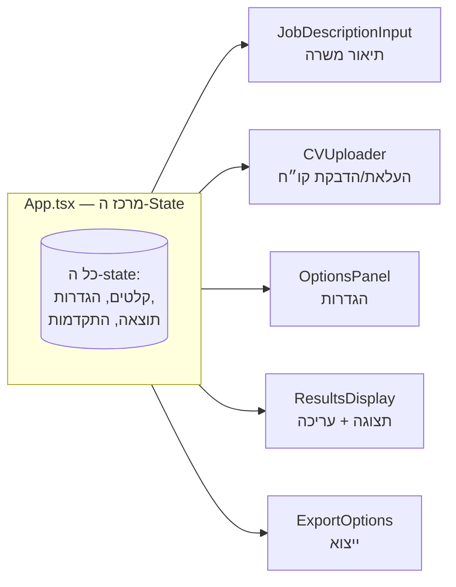
```mermaid
flowchart LR
    subgraph App["App.tsx — מרכז ה-State"]
        State[(כל ה-state:<br/>קלטים, הגדרות,<br/>תוצאה, התקדמות)]
    end
    App --> C1[JobDescriptionInput<br/>תיאור משרה]
    App --> C2[CVUploader<br/>העלאת/הדבקת קו״ח]
    App --> C3[OptionsPanel<br/>הגדרות]
    App --> C4[ResultsDisplay<br/>תצוגה + עריכה]
    App --> C5[ExportOptions<br/>ייצוא]
```

### הקומפוננטות

| קומפוננטה | תפקיד | פרטים בולטים |
|---|---|---|
| `JobDescriptionInput` | קלט תיאור המשרה | הדבקה מהלוח, ספירת תווים חיה, מינימום 50 |
| `CVUploader` | העלאת קובץ או הדבקת טקסט | גרירה-ושחרור, תמיכה ב-PDF/DOCX/TXT/MD, מינימום 100 תווים |
| `OptionsPanel` | בחירת הגדרות | מתג מכתב מקדים, רמת מחמירות, הערות חופשיות |
| `ResultsDisplay` | הקובץ הכבד (1031 שורות!) | 4 טאבים: קו״ח / מכתב / ניתוח / שינויים. עריכה inline, Revert/Re-apply, ציון התאמה גרפי |
| `ExportOptions` | ייצוא | Markdown/Word דרך השרת, PDF בצד הלקוח, העתקה ללוח |

### תכונות UX חכמות

- **Revert/Re-apply ליומן השינויים**: לכל שינוי אפשר ללחוץ "החזר" — המערכת מחפשת את הטקסט הנוכחי ומחליפה אותו בגרסה המקורית/החדשה.
- **ניתוח פערים ממוין** לפי חומרה, עם הצעות לגישור.
- **חילוץ קישורי הגשה** מתיאור המשרה (`utils/apply.ts`), עם סינון פרטי הקשר של המועמד.

---

## 8. התזמור בצד הלקוח — הסיפור החשוב ביותר

זהו השיעור הארכיטקטוני המרכזי של הפרויקט, והוא מקור ל-commit חשוב (`a26da62`).

### הבעיה

בגרסה המקורית, נקודת קצה אחת (`/api/tailor`) הריצה את **כל** הצנרת — 5-6 קריאות **רצופות** ל-Gemini — בתוך בקשת HTTP אחת. אבל פונקציית Serverless ב-Vercel מוגבלת ל-**60 שניות**. המודל `gemini-3.1-pro-preview` איטי, וחמש קריאות רצופות עברו את הגבול → **timeout בפרודקשן**.

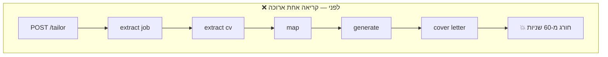
```mermaid
flowchart TD
    subgraph Before["❌ לפני — קריאה אחת ארוכה"]
        B1[POST /tailor] --> B2[extract job] --> B3[extract cv] --> B4[map] --> B5[generate] --> B6[cover letter]
        B6 --> BTimeout[💥 חורג מ-60 שניות]
    end
```

### הפתרון — שני חלקים

**חלק א': הדפדפן מתזמר את הצנרת.** במקום קריאה אחת ארוכה, הדפדפן עושה **קריאה נפרדת לכל שלב**. כל שלב הוא בקשה קצרה משלו עם תקציב 60 שניות נפרד.

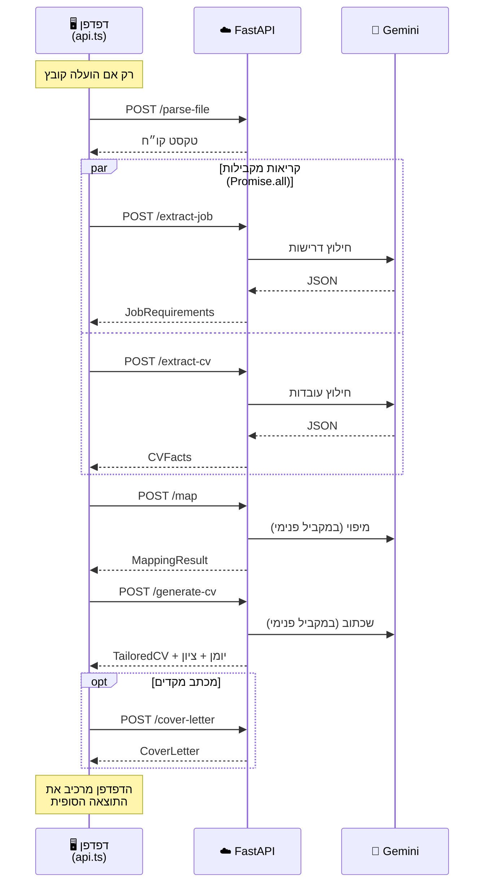
```mermaid
sequenceDiagram
    participant U as 🖥️ דפדפן<br/>(api.ts)
    participant API as ☁️ FastAPI
    participant G as 🤖 Gemini

    Note over U: רק אם הועלה קובץ
    U->>API: POST /parse-file
    API-->>U: טקסט קו״ח

    par קריאות מקבילות (Promise.all)
        U->>API: POST /extract-job
        API->>G: חילוץ דרישות
        G-->>API: JSON
        API-->>U: JobRequirements
    and
        U->>API: POST /extract-cv
        API->>G: חילוץ עובדות
        G-->>API: JSON
        API-->>U: CVFacts
    end

    U->>API: POST /map
    API->>G: מיפוי (במקביל פנימי)
    API-->>U: MappingResult

    U->>API: POST /generate-cv
    API->>G: שכתוב (במקביל פנימי)
    API-->>U: TailoredCV + יומן + ציון

    opt מכתב מקדים
        U->>API: POST /cover-letter
        API-->>U: CoverLetter
    end

    Note over U: הדפדפן מרכיב את<br/>התוצאה הסופית
```

**חלק ב': מקביליות בתוך כל שלב** (`asyncio.gather`) — כפי שתואר בפרק 5.3.

### היתרון הנוסף: פס התקדמות אמיתי

מכיוון שכל שלב הוא קריאה נפרדת, הדפדפן יודע בדיוק באיזה שלב אנחנו ומראה התקדמות **אמיתית** למשתמש — במקום אנימציה מזויפת.

### המחיר (trade-off)

זה גם מקור ל"מכוער" מסוים: השרת כבר לא אוכף את שלמות הצנרת מקצה לקצה. לקוח יכול לקרוא ל-`/generate-cv` עם נתונים שרירותיים, לדלג על שלבים, או להפעיל endpoint בודד שוב ושוב. האמון עבר לדפדפן.

---

## 9. פריסה (Deployment) — Vercel, CI ו-Docker

### 9.1 איך זה רץ בפרודקשן (Vercel)

הפרודקשן הוא **היברידי**: אתר סטטי + פונקציית Python אחת.

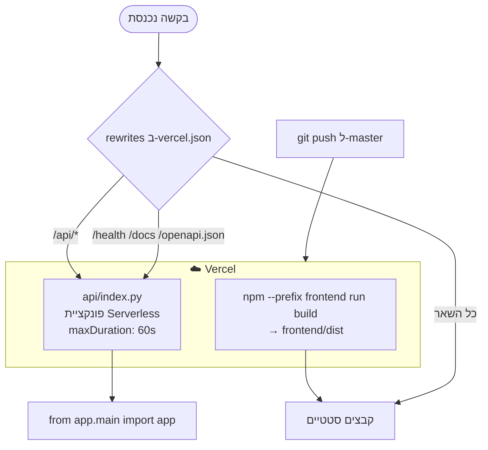
```mermaid
flowchart TD
    Push[git push ל-master] --> Vercel
    subgraph Vercel["☁️ Vercel"]
        Build["npm --prefix frontend run build<br/>→ frontend/dist"]
        Func["api/index.py<br/>פונקציית Serverless<br/>maxDuration: 60s"]
    end
    Build --> Static[קבצים סטטיים]

    Req([בקשה נכנסת]) --> Router{rewrites ב-vercel.json}
    Router -->|/api/*| Func
    Router -->|/health /docs /openapi.json| Func
    Router -->|כל השאר| Static
    Func --> App[from app.main import app]
```

נקודות מפתח:
- **`api/index.py`** הוא מתאם דק (11 שורות בלבד): הוא מוסיף את תיקיית `backend` ל-`sys.path` ומייבא את אפליקציית FastAPI. אין צורך ב-Mangum — Vercel מזהה את ה-`app` של ASGI לבד.
- **`vercel.json`** מגדיר את ה-build, את הפונקציה (60 שניות), ואת ה-rewrites (ניתוב כתובות).
- **CD אוטומטי**: כל push ל-`master` נפרס אוטומטית. כל PR מקבל preview.

### 9.2 CI — בדיקות אוטומטיות (`.github/workflows/ci.yml`)

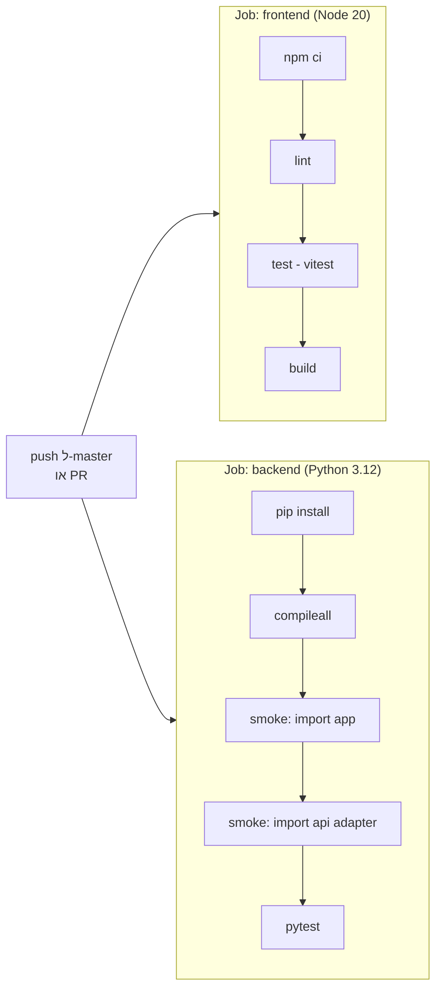
```mermaid
flowchart LR
    Trigger[push ל-master<br/>או PR] --> FE & BE
    subgraph FE["Job: frontend (Node 20)"]
        F1[npm ci] --> F2[lint] --> F3[test - vitest] --> F4[build]
    end
    subgraph BE["Job: backend (Python 3.12)"]
        B1[pip install] --> B2[compileall] --> B3[smoke: import app] --> B4[smoke: import api adapter] --> B5[pytest]
    end
```

נקודה חשובה: ה-CI כולל **בדיקת עשן** שמוודאת שהמתאם של Vercel (`from api.index import app`) עדיין מתייבא. אבל ⚠️ **ה-CI לא חוסם את הפריסה** — Vercel נפרס בנפרד, אז master "אדום" עדיין יכול להגיע לפרודקשן.

### 9.3 Docker — רק לפיתוח מקומי

`docker-compose.yml` מריץ שני קונטיינרים (backend על 8000, frontend על 5173) עם `--reload` ו-Vite dev server. ⚠️ זה **לא** מייצג את הפרודקשן — בפרודקשן רצות פונקציות Serverless, לא שרת uvicorn ארוך-חיים. Docker כאן הוא נוחות פיתוח בלבד.

### 9.4 סודות וסביבה

| משתנה | היכן | הערה |
|---|---|---|
| `GEMINI_API_KEY` | בצד השרת בלבד | בפרודקשן: הגדרות Vercel. אף פעם לא מגיע ללקוח. |
| `CORS_ORIGINS` | שרת | מקבל גם localhost וגם `*.vercel.app` |
| `VITE_API_URL` | לקוח | בפרודקשן `=/api` (אותו origin) |

ה-endpoint `/set-api-key` חסום (403) אלא אם `DEBUG=true` — החלטת אבטחה נכונה.

---

## 10. בדיקות (Tests)

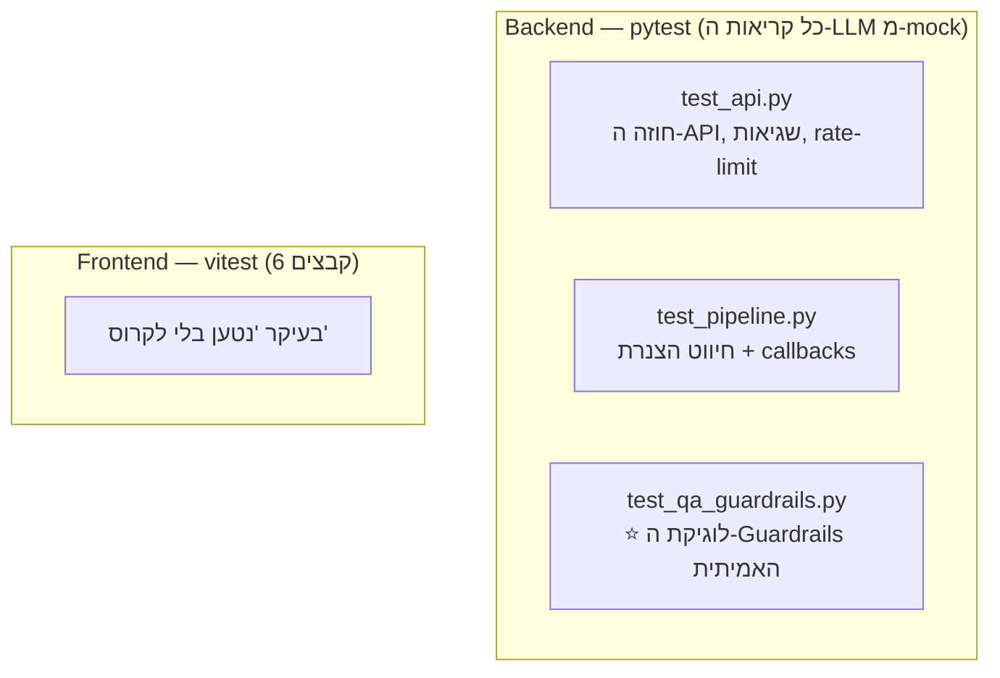
```mermaid
flowchart TD
    subgraph BET["Backend — pytest (כל קריאות ה-LLM מ-mock)"]
        T1[test_api.py<br/>חוזה ה-API, שגיאות, rate-limit]
        T2[test_pipeline.py<br/>חיווט הצנרת + callbacks]
        T3[test_qa_guardrails.py<br/>⭐ לוגיקת ה-Guardrails האמיתית]
    end
    subgraph FET["Frontend — vitest (6 קבצים)"]
        F1[בעיקר 'נטען בלי לקרוס']
    end
```

- **Backend**: כיסוי טוב של חוזה ה-API ושל לוגיקת ה-Guardrails (ה"פנינה" של הסוויטה). כל קריאות ה-AI מ-mock, אז ה-CI מהיר ולא צריך מפתח.
- **Frontend**: בדיקות שטחיות יחסית ("נטען בלי לקרוס", החלפת טאבים).
- **חסר**: בדיקות ל-endpoints החדשים של התזמור (`/map`, `/generate-cv`), בדיקות ל-`api.ts` (כל לוגיקת התזמור), בדיקות ל-`apply.ts`, ואין בדיקות end-to-end.

---

## 11. הטוב, הרע והמכוער

### ✅ הטוב

- **ארכיטקטורה נקייה ומטופסת היטב** — 6 מודולים מגובשים, מודלי Pydantic חזקים, הפרדה ברורה בין services/utils/routers/models.
- **הנדסת מקביליות אמיתית** — שימוש מתוחכם ב-`asyncio.gather` כדי לעמוד בגבול 60 השניות, עם הערות שמסבירות למה.
- **חישוב ותק נכון** — מיזוג תקופות תעסוקה חופפות במקום סכימה נאיבית.
- **נפילה רכה (graceful degradation)** — אם שכתוב שורה נכשל, חוזרים לשורה המקורית; ריצה אחת לא נשברת.
- **פתרון מצוין ל-timeout** — תזמור בצד הלקוח + מקביליות, עם פס התקדמות אמיתי.
- **המפתח אף פעם לא מגיע ללקוח**, ו-`/set-api-key` חסום בפרודקשן.
- **בדיקות אמיתיות קיימות** — במיוחד ל-Guardrails ולחוזה ה-API.

### ⚠️ הרע

- **ה-Guardrails נאיביים** — השוואת מחרוזות מדויקת, נותנת תחושת ביטחון מוטעית, מפספסת המצאות בטקסט חופשי, ועלולה להכשיל ריצות כנות בגלל ניסוח שונה.
- **חילוץ JSON שברירי** בנתיב הטקסט החופשי (חיתוך סוגריים), וללא ניסיון חוזר דווקא בשלבים הכי שבירים (שכתוב, מכתב).
- **כפילות לוגיקה** בין הצנרת המונוליטית לבין ה-endpoints של התזמור — שני נתיבי קוד לתחזק.
- **כפילות קבצי תלויות** — `api/requirements.txt` מול `backend/requirements.txt` מסונכרנים ידנית, מועדים לסטייה.
- **אין lockfile** ותלויות עם `>=` בלבד → build לא רפרודוקטיבי.
- **AGENTS.md לא מעודכן** — טוען ש"אין בדיקות אוטומטיות", וזה כבר לא נכון.
- **קוד מת ב-Frontend** — בחירת `outputFormat` ב-OptionsPanel לא נשלחת בכלל ל-API; 3 פונקציות API ישנות לא בשימוש.

### 🔴 המכוער

- **🚨 אין שום אימות (Authentication).** כל ה-endpoints פתוחים לעולם. זה הסיכון הגדול ביותר: כל אחד יכול להפעיל את ה-endpoints שעולים כסף (קריאות Gemini) — וקטור לניצול ולחשבון תפוח.
- **Rate-limiting לא עובד בפרודקשן** — מוגדר `storage_uri="memory://"`, אבל ב-Serverless כל מופע הוא זיכרון נפרד וזמני, אז המגבלה כמעט חסרת משמעות. צריך Redis/Upstash.
- **Singleton גלובלי של ה-LLM** שניתן לשינוי דרך endpoint — מצב גלובלי שמשתנה בזמן ריצה, מסוכן תחת מקביליות.
- **שגיאות 500 מחזירות `str(e)` ללקוח** — דליפת טקסט שגיאה פנימי.
- **אין הגבלת גודל קובץ** בהעלאה — קוראים את כל הקובץ ל-RAM, סיכון DoS.
- **HTML לא-escaped ביצירת PDF** בצד הלקוח — תוכן עם `<` או `&` עלול לשבור/לזהם את הפלט.
- **`ResultsDisplay.tsx` — מפלצת של 1031 שורות** שמערבבת ~8 קומפוננטות.
- **alert() נוקשה** במקום הודעות MUI מהוקצעות.

---

## 12. מה חסר בפרויקט

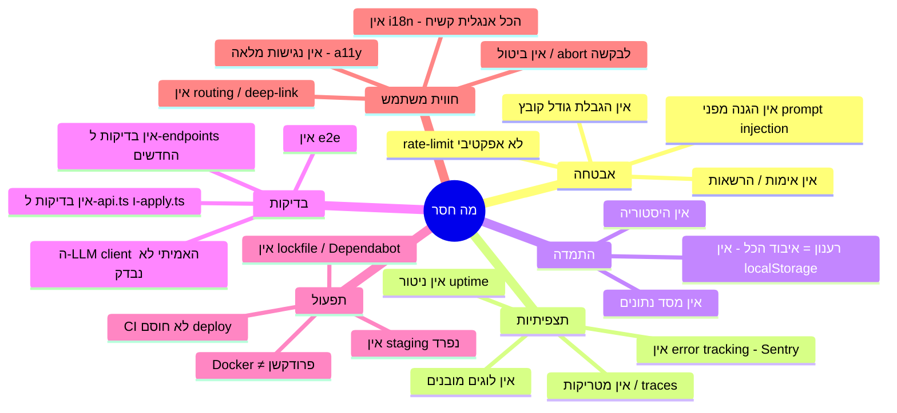
```mermaid
mindmap
  root((מה חסר))
    אבטחה
      אין אימות / הרשאות
      אין הגנה מפני prompt injection
      אין הגבלת גודל קובץ
      rate-limit לא אפקטיבי
    תצפיתיות
      אין error tracking - Sentry
      אין מטריקות / traces
      אין לוגים מובנים
      אין ניטור uptime
    התמדה
      אין מסד נתונים
      אין היסטוריה
      רענון = איבוד הכל - אין localStorage
    בדיקות
      אין e2e
      אין בדיקות ל-endpoints החדשים
      אין בדיקות ל-api.ts ו-apply.ts
      ה-LLM client האמיתי לא נבדק
    תפעול
      CI לא חוסם deploy
      אין lockfile / Dependabot
      Docker ≠ פרודקשן
      אין staging נפרד
    חווית משתמש
      אין נגישות מלאה - a11y
      אין ביטול / abort לבקשה
      אין routing / deep-link
      אין i18n - הכל אנגלית קשיח
```

**הפערים הקריטיים ביותר (לפי סדר עדיפות):**

1. **אימות + rate-limit אמיתי** — כרגע ה-API פתוח לעולם ויכול לשרוף את תקציב ה-Gemini.
2. **תצפיתיות** — בלי Sentry/לוגים מובנים, אי אפשר לדעת מה נשבר בפרודקשן.
3. **חיזוק ה-Guardrails** — לעבור מהשוואת מחרוזות לבדיקה סמנטית, ולכסות גם טקסט חופשי.
4. **ניקוי טכני** — איחוד קבצי התלויות, lockfile, פיצול `ResultsDisplay`, הסרת קוד מת.

---

## 13. סיכום והמלצות

**TailorCV הוא פרויקט פורטפוליו מרשים ומהונדס היטב.** הוא מדגים:
- חשיבה מוצרית אמיתית (פילוסופיית "ללא המצאות", רמות מחמירות).
- הנדסה מתוחכמת (תזמור בצד הלקוח + מקביליות כדי לנצח את גבול ה-Serverless).
- קוד נקי, מטופס, עם בדיקות.

ובו-זמנית, הוא נושא את החתימות הקלאסיות של פרויקט שנבנה מהר להדגמה: **אין אימות, אין תצפיתיות, ה-Guardrails נאיביים, ויש חוב טכני** (כפילויות, קוד מת, קובץ ענק).

### המלצות מעשיות (אם ממשיכים לפתח)

| עדיפות | פעולה | מאמץ |
|---|---|---|
| 🔴 גבוהה | להוסיף אימות בסיסי (API key / Clerk) + rate-limit על Upstash | בינוני |
| 🔴 גבוהה | לחבר Sentry ולוגים מובנים | נמוך |
| 🟡 בינונית | לחזק את ה-Guardrails (נרמול מחרוזות, כיסוי טקסט חופשי) | בינוני |
| 🟡 בינונית | לאחד `requirements.txt`, להוסיף lockfile | נמוך |
| 🟢 נמוכה | לפצל את `ResultsDisplay.tsx`, להסיר קוד מת | נמוך |
| 🟢 נמוכה | בדיקות ל-`api.ts`, `apply.ts`, ול-endpoints החדשים | בינוני |

---

<div align="center">

*מסמך זה נוצר מתוך ניתוח מעמיק של קוד המקור. כל ההפניות לקבצים אומתו מול הקוד בפועל.*

</div>

</div>
